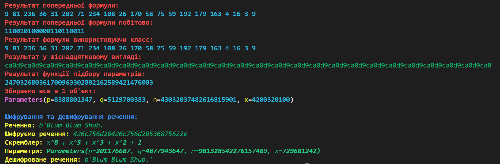
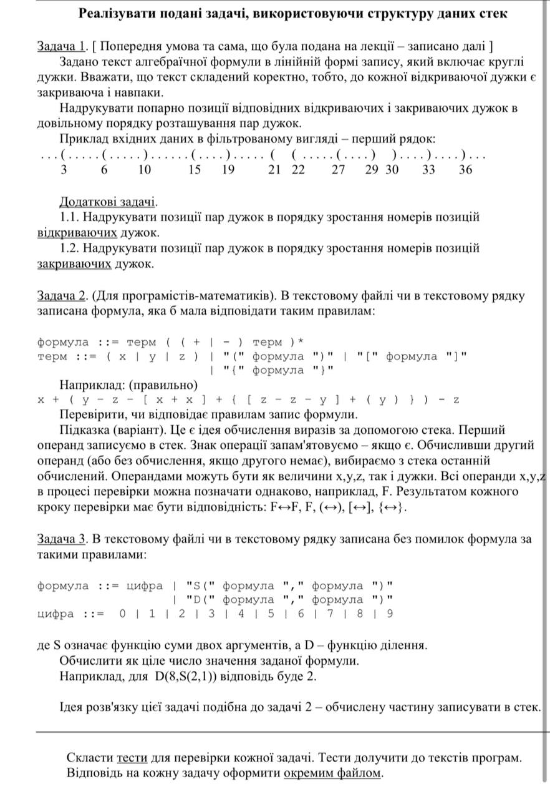

# Python_testing
---
## Chipter

Завдання:

Потоковий шифр на основі генератора BBS
1.	Створити програму, яка реалізовує потоковий шифр на основі генератора BBS. 
2.	Згенерувати два великих простих числа p, q, обчислити модуль n та випадкове число x. 
3.	За допомогою створеної програми зашифрувати та розшифрувати повідомлення. 

Дано:

f(x) = x^2 mod(M)

У цій формулі M є добутком p і q , двох великих простих чисел.

Складність цього алгоритму прихована в параметрах; початковий елемент і модуль M  Щоб мати тривалий цикл і виконувати свої обіцянки щодо безпеки, Blum Blum Shub має кілька обмежень щодо своїх параметрів.
Навпаки, деякі складніші алгоритми PRNG можуть працювати майже з будь-яким рандомізованим початковим числом.

Обмеження:
1. Початковий код має бути співпростим для (p і q) . Це означає, що їхній найбільший спільний дільник має бути 1.
2. (p і q) мають відповідати "3 (mod 4)". Це означає, що (p % 4) обидва (q % 4) мають бути "3".
3. (p і q) мають бути безпечними простими числами.

Задачі:

1.	Створити функцію  генерування  ключів  шифру за допомогою  n-розрядного регістра зсуву зі зворотним зв'язком (значення n залежить від степеня багаточлена, вказаного у варіанті). Послідовність роботи регістра зсуву зі  зворотним зв'язком у вигляді таблиці див. (лекція 8 слайд 9)
2.	Реалізувати шифрування та розшифрування на заданому ключі відкритого тексту з алфавіту Z2. 
Скремблер: x^8 + x^5 + x^3 + x^2 + 1

Результат виконання программи:

---
## task-1

1. Задача 1. З файла читають цілі числа різних знаків. Послідовність чисел закінчується нулем, наприклад:
3 28 -4 901 666 -25 -25 700 -1 0
Обчислити: 
1) кількість додатніх чисел; 
2) кількість від’ємних чисел; 
3) середнє арифметичне від’ємних.
2. Задача 2. Задано три числа a, b, c цілі або дійсні. Виначити: 1)чи можуть такі числа означати довжини відрізків; 2)якщо означають, то чи можна з таких відрізків утворити трикутник і який – рівносторонній, рівнобедрений, різносторонній.
3. Задача 3. Задане речення поділити на слова і надрукувати їх в стовпчик. Окрема функція організації тестування Файл тестових вхідних даних за визначеним форматом Функція з параметрами – реалізація задачі InData1, InData2, … Testorg FnSol1, FnSol2, … Можливість незалежного зовнішнього редагування Файл протокола
тестування ResultAll (або Res1, Res2, …) вид тестування - <назва> 
вхід: дані, прочитані з файла
вихід: отримані результати
від функції або коментар про тест
Завдання: функції, розробка, тестування [ Ч.В.В. ] 2
4. Задача 4. Задано двовимірний масив додатніх, від’ємних і нульових цілих чисел розміром NN. Знайти підпрямокутник з найбільшою сумою. [ Оптимізація і швидкість не потрібні. ] Підпрямокутник – це будь-який неперервний підмасив прямокутної форми заданого масиву. Сума підпрямокутника – це сума всіх його елементів.

Усі задачі виконано на 8/8, Для кожної задачі є по 4 файла для текстування розташовані у папці "Testing_files" під відповідними номерами, результат для всіх завдань це вихідний єдиний файл "ResultAll.txt". Код простий та повністю розкоментований.

---
## task-2

1. Реалізувати приклад макета окремих частин проєкта, який можна
використати як представлення пропозиції (реклама) чи уточнення постановки
задачі для розробки. Оцінити окремі кроки розробки проєкта.
2. Використати структуру даних dict (словник) для отримання досвіду
програмування операцій з словниками практичного наповнення.

Для цього завдання я за допомогою парсингу створив список усіх міст України, після чого спарсив із синоптика інформацію по кожному місту та помістив її у файл "Weather_Info.txt", І уже на основі цих данних виконував усі задачі

Проект було оцінено на 9/8

---
## task-3

Побудувати прототип інформаційно-довідкової системи
про пересування містом трамваями у Львові

Мета завдання:
1. Отримати первинне ознайомленнями з деякими аспектами будови
інформаційно-довідкових систем. Навчитись програмувати подібні системи.
2. Навчитись будувати сховища чи зображення даних для забезпечення роботи
системи. Вміти проводити первинну підготовку даних до форматів, які
забезпечують швидке реагування на запити користувачів і зручне програмування
функцій інформаційно-довідкових систем

4. Для коректного виконання наступних кроків проєкту треба мати в "письмовій"
формі повний перелік назв всіх зупинок всіх трамвайних маршрутів в сукупності.
Це може бути звичайний текстовий файл, в якому в кожному рядку записана
назва однієї зупинки.
Склавши загальний список, його треба сортувати за алфавітом, після чого
вручну чи програмно викреслити назви, які повторюються.
Такий список потрібний для того, щоб забезпечити правильне однакове
позначення в процесі програмування. Для перенесення назви зупинки в код
програми можна просто копіювати і вставляти потрібну назву Ctrl-C, Ctrl-V. Якщо
загального списку не буде, тоді при ручному друкуванні можливі такі випадки, як
"Площа Кропивницького", "площа Кропивницького", "пл.Кропивницького",
"Кропивницького", які з точки зору формального синтаксису означають різні
назви.

3. Вибір і підготовка структур даних. Обмежимо наш проєкт вбудованими
структурами даних: текст, список, кортеж, множина, словник.
Важливо добре продумати програмне зображення даних, викладене в п.1, з
огляду на зручне програмування і швидкий пошук відповідей на запитання.
Наприклад, можна взяти за основу словник, ключами якого будуть номери
трамвайних маршрутів, а значеннями – три елементи: список зупинок в одному
напрямі, список зупинок в зворотньому напрямі, множина всіх зупинок на
маршруті.

5. Приклади запитів і форматів відповідей. Для цілей нашого проєкту будемо
будувати всі запити і відповіді в форматі назв трамвайних зупинок. Ключові слова
запитів і відповідей підкреслені. Список ключових слів треба визначити окремо
як частину інструкції користування інформаційно-довідковою системою.
Загальне зауваження. Якщо відповідь можна будувати різними способами,
обрати будь-яку одну відповідь, щоб не ускладнювати проєкт.

Для початку я у інтернеті знайшов усі маршрути, та спарсив із них усі назви вулиць/площ/зупинок, після чого обробив ці дані, посортував їх та записав у 1 файл.
Після чого помістив усі дані в 1 словник де ключ - номер маршруту, а значення це почерговий список зупинок, та приступив до виконання задач які успішно було виконано.

Проект оцінено на 8/8

---
## task-4

Все виконано за допомогою стеку, усі тестові файли та результати записані по відповідних .txt файлах.

Проект виконано на 8/8.

---
## task-5

Задача. Побудувати програмну модель організації прикордонного митного контролю.
Використати структуру даних черги, створити власний клас з методами базовими для черги
як структури, і зв'язаними зі змістом задачі – це найперша вимога до виконання завдання.
Задачу моделювати для вантажних перевезень. Вантажні авто прибувають до кордону,
стають в чергу на митний огляд, проходять огляд, після огляду рухаються далі до пункту
призначення або отримують інші розпорядження.

Частина 4. Операції митного контролю. [ Методи, зв'язані зі змістом задачі – вимога ]
- поставити авто в чергу для огляду; (одну або другу)
- закінчити огляд і дозволити перетин кордону – читати з черги;
- перевести авто з однієї черги в кінець другої;
- викреслити авто з черги (немає дозволу на перетин кордону);
- скласти перелік авто (місце в черзі), які везуть вказаний товар;
- яке авто має товар найбільшої вартості?
- таблиця товарів і цін, перевезених через кордон (підсумок);
- які авто прямують до Одеси?
- інші операції – додати самостійно.

Завдання реалізувати в цілому за технологією ООП. Все оформити одним модулем
(файлом).

Дані заповнені вручну, усі завдання виконано із дотриманням умов.

Оцінка за проект 8/8